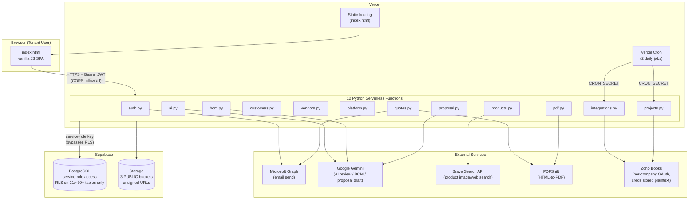

# Current Architecture — Phase 1: Repository & Technology Discovery

All items below are evidence-based (file/line cited); anything not directly observable in the repository is marked **NOT VERIFIED**.

## 1. Frontend
Single static HTML file, `index.html` (4,471 lines), vanilla JavaScript, no build step, no framework (no React/Vue/etc. dependency anywhere in the repo, no `package.json` at all in the app itself — only `npm install jsdom --no-save` for the test runner). Served as a static asset by Vercel (`vercel.json`: `{ "src": "index.html", "use": "@vercel/static" }`, catch-all route `/(.*) → index.html`).

## 2. Backend
Python 3 (`runtime.txt`), Flask 3.0.3 (`requirements.txt`), deployed as 12 independent Vercel Python Serverless Functions — one file per route group, each a fully self-contained Flask app (no shared imports between them; explicitly documented in code comments as a Vercel Python-builder constraint: "Vercel's Python builder only bundles the single entrypoint file per route"). Files: `api/auth.py`, `api/quotes.py`, `api/ai.py`, `api/pdf.py`, `api/products.py`, `api/bom.py`, `api/customers.py`, `api/vendors.py`, `api/integrations.py`, `api/platform.py`, `api/proposal.py`, `api/projects.py`. Two additional files (`api/pp_sync.py`, `api/project_performance.py`) exist in the repo but are **not registered** in `vercel.json` and are therefore dead/unreachable in production (see `REL-002`).

## 3. Database & ORM
Supabase-hosted PostgreSQL, accessed via the `supabase-py` client (`supabase==2.5.0`), not a traditional ORM — every query is built with the Supabase query builder (`.table(...).select(...).eq(...).execute()`). No SQLAlchemy/Django ORM/Prisma equivalent. `schema.sql` is the closest thing to a canonical schema definition but is confirmed stale/incomplete (`REL-001`).

## 4. Authentication provider
Custom, homegrown — not a third-party auth provider (no Auth0/Clerk/Supabase Auth/Firebase Auth usage found). Passwords hashed with `bcrypt` (`bcrypt==4.1.3`); sessions are stateless HS256 JWTs signed with `JWT_SECRET`, issued by `api/auth.py`'s `make_token()` and decoded independently by every route file's own copy of `verify_token()`.

## 5. Authorization method
Claims-based: the JWT carries `user_id`, `company_id`, `role` (`admin`|`user`), `is_platform_admin` (bool), and `features` (a JSONB snapshot of `companies.features`). Every route derives its tenant scope and permission decisions from these claims. See `AUTHORIZATION-MATRIX.md` for the full role/permission breakdown.

## 6. Hosting & deployment
Vercel, two projects referenced in project notes: `sysconic-quotes` (production, `sysconic-quotes.vercel.app`) and `sysconic-quotes-staging` (staging). Three-branch Git flow: `dev` → `staging` (auto-deploy) → `main` (production), per `.github/workflows/tests.yml`'s trigger branches (`dev`, `staging`, `main`).

## 7. File storage
Supabase Storage, three buckets in active use: `product-images` (`api/products.py`), `company-assets` (`api/auth.py`, company logos), `proposals` (`api/proposal.py`, generated PDF proposals). All three are public with unsigned URLs — see `TEN-002`.

## 8. Email provider
Microsoft Graph API via an Entra ID (Azure AD) app registration using the client-credentials flow (`MS_TENANT_ID`/`MS_CLIENT_ID`/`MS_CLIENT_SECRET`), sending from either a fixed sender (`SENDER_EMAIL`, invites/resets) or the logged-in user's own configured M365 mailbox (`ms365_email`, customer-facing quote emails). No SendGrid/Postmark/SES usage found.

## 9. Queue / background processing
No dedicated queue system (no Celery/RQ/SQS/BullMQ). Two Vercel Cron Jobs defined in `vercel.json`: `/api/integrations/run-auto-sync` (daily, `0 3 * * *`) and `/api/pp-sync/run-auto-sync` (daily, `0 4 * * *`), both authenticated via a shared `CRON_SECRET` bearer token rather than user JWTs. Long-running Zoho sync work is explicitly time-boxed within each HTTP invocation (`MANUAL_SYNC_TIME_BUDGET_SECONDS = 8`, `CRON_SYNC_TIME_BUDGET_SECONDS = 45` in `api/projects.py`) to stay under Vercel's function duration limits, with an oldest-synced-first resumption strategy rather than a true durable queue.

## 10. Logging & monitoring
`print()` / `traceback.print_exc()` only, visible in Vercel's function log viewer. No APM/error-tracking SDK (Sentry, etc.) found anywhere in the codebase or `requirements.txt`. See `REL-003`.

## 11. Testing frameworks
One frontend test file, `tests/run-tests.mjs`, using Node's built-in test runner pattern (no Jest/Mocha/Vitest dependency — hand-rolled `check()` helper) plus `jsdom` to boot `index.html` in a simulated browser with a mocked `fetch`. No Python test framework (no pytest/unittest usage) exists anywhere in the repo. See `TEST-001`.

## 12. CI/CD configuration
GitHub Actions, single workflow `.github/workflows/tests.yml`, single job (`frontend-tests`), triggered on push to `dev`/`staging`/`main` and on PRs targeting `staging`/`main`. Runs only `node tests/run-tests.mjs`. No lint, type-check, dependency-audit, or secret-scan job exists. See `REL-006`.

## 13. External APIs & integrations
- **Zoho Books** (`api/integrations.py`, `api/projects.py`'s `_ZohoSync`) — customer/vendor contact sync, project creation, and Project Performance actuals (purchase orders, bills, expenses, invoices, payments) pull, all via per-company OAuth refresh-token credentials stored in `company_integrations.credentials`.
- **Microsoft Graph** — see §8.
- **Brave Search API** (`api/products.py`) — product web/image search, replacing a previously-used Google Custom Search integration (per code comments, "closed to new customers in 2026").
- **PDFShift** (`api/pdf.py`, `api/quotes.py`) — headless-Chromium HTML-to-PDF rendering for the pixel-exact quote/proposal PDF path (a ReportLab-based fallback PDF builder also exists in `api/pdf.py` and `api/proposal.py`).

## 14. AI services
Google Gemini (`gemini-3.5-flash`, called directly via the `generativelanguage.googleapis.com` REST endpoint, no SDK) — three features: AI Quote Review (`api/ai.py`), Auto-BOM generation (`api/bom.py`), and Proposal content drafting (`api/proposal.py`). All three ground their output in real, company-scoped data (live quote JSON, or the company's own product catalog) rather than letting the model invent prices — verified in each file.

## 15. Payment / subscription services
**NOT FOUND.** No Stripe/Paddle/Chargebee/Braintree integration, no billing webhook route, no subscription-management code exists anywhere in the repository. `companies.plan` and `companies.status` are free-text columns with no enforcement logic beyond a binary `active`/`suspended` gate checked at login. See `SUB-001`.

## 16. Environment configuration
`.env.local` (gitignored, contains the actual working credentials for this environment) and `.env.example` (also gitignored despite its name — confirmed not tracked via `git ls-files`, but flagged as a real risk anyway; see `APP-001`). Key variables read via `os.environ.get(...)` throughout `api/*.py`: `SUPABASE_URL`, `SUPABASE_SERVICE_KEY`, `JWT_SECRET`, `MS_TENANT_ID`/`MS_CLIENT_ID`/`MS_CLIENT_SECRET`, `SENDER_EMAIL`, `APP_URL`, `GEMINI_API_KEY`, `BRAVE_API_KEY`, `PDFSHIFT_API_KEY`, `CRON_SECRET`.

## 17. Repository structure
```
/
├── api/                     12 deployed Flask serverless functions + 2 orphaned files
├── index.html               entire frontend (4,471 lines)
├── schema.sql                original (now partial/stale) schema
├── migration-*.sql           9 point migrations, inconsistently covering schema drift
├── migrate-internal-company.sql
├── vercel.json                routing, build, and cron configuration
├── requirements.txt / runtime.txt
├── tests/run-tests.mjs        sole automated test file
├── .github/workflows/tests.yml
├── docs/                      (this audit's output, plus a design-reference PDF)
├── multi-tenant-audit-report.txt, sysconic-code-and-architecture-audit.md,
│   multi-tenant-audit-spec.md    prior internal audit artifacts (root level)
└── .env.example / .env.local (gitignored)
```

## 18. Database migrations
Nine point-migration `.sql` files plus `schema.sql` and `migrate-internal-company.sql`. Not a managed migration tool (no Alembic/Supabase-CLI-migrations/Flyway) — files are applied manually ("Go to Supabase → SQL Editor → paste → Run", per `README.md`). Confirmed incomplete: `customers`, `company_integrations`, and `projects` tables exist in the live database with no corresponding tracked `CREATE TABLE` anywhere in the repo. See `REL-001`.

## 19. Scheduled jobs / serverless functions
Every backend route is itself a Vercel serverless function (see §2). Two Vercel Cron Jobs (see §9). No other scheduled job mechanism found.

## 20. Publicly exposed endpoints (no auth required)
- `POST /api/auth/register`, `POST /api/auth/login`, `POST /api/auth/forgot-password`, `POST /api/auth/reset-password`, `POST /api/auth/accept-invite`, `GET /api/auth/invite-details` — all intentionally public (pre-authentication flows).
- `GET/POST /api/integrations/run-auto-sync`, `GET/POST /api/pp-sync/run-auto-sync` (routed to `api/projects.py`) — gated by `CRON_SECRET` bearer/query/header rather than a user JWT; not "public" in a meaningful sense but worth noting as a non-standard auth mechanism (see `API-SECURITY-AUDIT.md`).
- All Supabase Storage bucket contents (public buckets — `TEN-002`).

Full endpoint-by-endpoint detail (method, auth, tenant source, permission, validation) is in `API-SECURITY-AUDIT.md`.

## Architecture diagram



**NOT VERIFIED (no dashboard/infra access in this audit):** exact Vercel plan tier and its Serverless Function count limit (inferred as "Hobby, 12-function cap" from code comments only); whether `sysconic-quotes-staging` currently points at a separate Supabase project or the same one as production (`REL-004`); Vercel-level security headers, WAF, or DDoS configuration; Supabase project's own network/IP allowlist configuration.
