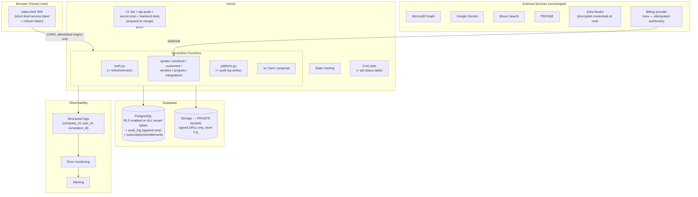

# Proposed Target Architecture

This is a forward-looking target state, not a prescription to rebuild anything. The current architecture's core decisions (serverless Python + Supabase Postgres + a single-file frontend) are sound for this product's scale and should not be replaced wholesale — the target state below is about closing the gaps identified in this audit while preserving what already works.

## What should stay exactly as-is
- Supabase Postgres as the primary datastore.
- JWT claims-based authorization model (`role`, `is_platform_admin`, company-scoped) — the shape is right, only the token lifecycle needs hardening (see below).
- The `company_id`-per-row shared-schema tenancy model — there is no evidence this product needs schema-per-tenant or database-per-tenant at its likely scale (tens to low hundreds of companies, not thousands of enterprise customers with strict data-residency-per-tenant requirements). Re-litigating this decision would be premature.
- The reviewer-assignment-based internal approval workflow — genuinely well-designed, keep the model, just add test coverage.
- Vercel serverless hosting — stateless-by-design is the right foundation for horizontal scale.

## What should change

### 1. Database-level tenant isolation as a real safety net
Enable RLS on every tenant table (P0 item 3 in `REMEDIATION-ROADMAP.md`). Once done, revisit whether *every* backend operation truly needs the service-role key, or whether some lower-privilege, RLS-respecting path (e.g. for read-only reporting endpoints) could use a scoped key instead — turning RLS from a pure safety net into an active second gate for at least some traffic.

### 2. Private storage with signed URLs, tenant-aware from end to end
Every stored file access should require a fresh, short-lived signed URL issued by an authenticated, company-scoped request — never a permanent public URL.

### 3. A real session model
Short-lived access tokens (e.g. 1 hour) plus a refresh-token table that can be individually revoked, replacing the current 30-day non-revocable JWT. This also solves `TEN-003`'s role/feature-staleness problem as a side effect, since a shorter-lived access token naturally bounds how stale an embedded claim can get.

### 4. A proper entitlements/subscription layer
Before any billing integration is built, add the underlying data model: `plans` (name, limits, price), `company_subscriptions` (company_id, plan_id, status, trial_end, current_period_end), `usage_counters` (company_id, metric, period, count). Server-side enforcement checks against this model (not the JWT snapshot) for every gated feature/limit. Only after this foundation exists should a billing provider's webhook integration (Stripe is the natural fit for this stack) be layered on top, with idempotent webhook processing from day one.

### 5. A minimal but real observability stack
Structured JSON logging with `company_id`/`user_id`/a generated correlation ID on every log line; a lightweight error-monitoring SDK; a platform-admin and company-level audit log table, append-only (enforced via a `REVOKE UPDATE, DELETE` on the table for all roles except a narrow maintenance path, or an RLS policy that blocks non-INSERT operations for ordinary application roles).

### 6. A genuine CI gate
Lint + type-check (even a lightweight one) + `pip-audit` + secret scanning + the new backend test suite, all required before merge to `staging`/`main`. This is the multiplier that makes every other item on this list durable rather than a one-time fix that quietly regresses.

### 7. A supported "support access" model, only if actually needed
If/when a genuine need arises for platform staff to act on a tenant's behalf (debugging a customer issue, for example), build it as a first-class, fully audited `support_sessions` model (`platform_admin_id`, `company_id`, `reason`, `started_at`, `expires_at`, `ended_at`, a visible in-app banner during the session, and hard exclusion from ever reading stored credentials) rather than reusing the platform-admin's existing unrestricted database access ad hoc. Today's "no impersonation exists at all" is a safer resting state than a half-built version — this is a "build it right or don't build it yet" item, not urgent.

## Target architecture diagram

## Sequencing relative to the roadmap
This target state is reached incrementally through the P0→P1→P2→P3 sequence already laid out in `REMEDIATION-ROADMAP.md` — nothing here requires a rewrite or a big-bang migration. The riskiest single piece of forward-looking work is the subscription/entitlements foundation (item 4), which is explicitly scoped as "design before build" and should not be started until the P0/P1 security and reliability items are closed.
